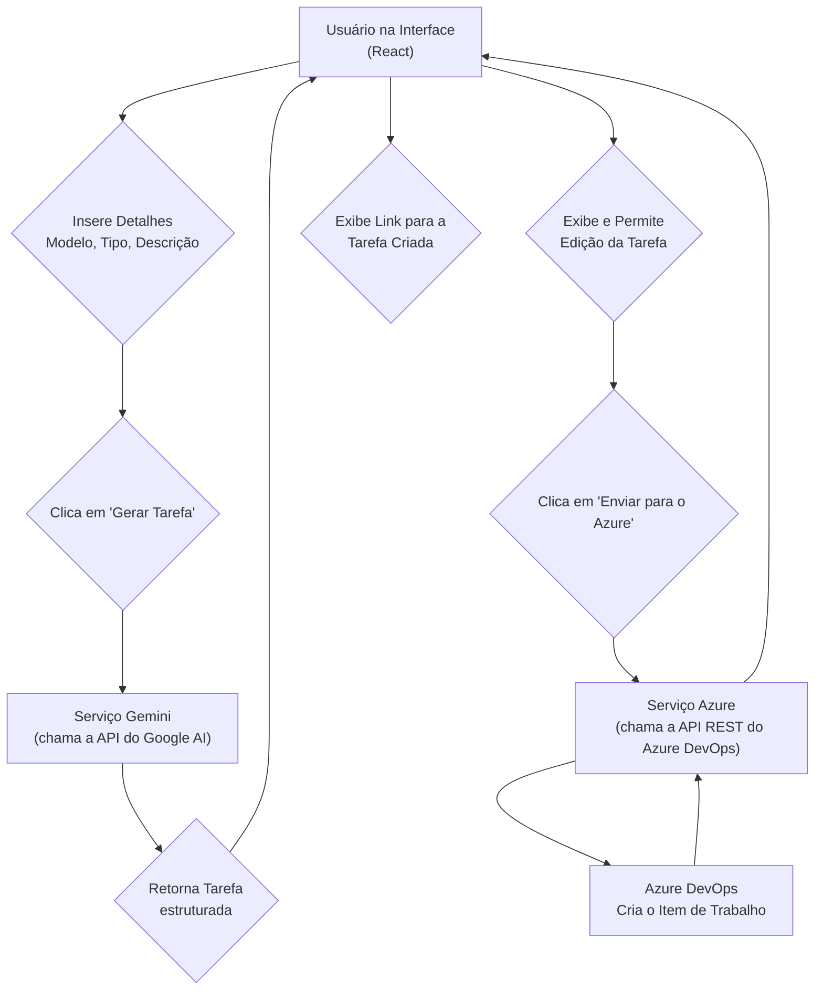

# Gerador de Tarefas Azure com IA

Este projeto foi desenvolvido como parte de um hackathon com o objetivo de otimizar o processo de criação de itens de trabalho no Azure DevOps.

## Objetivos do Hackathon

Nossa meta era construir uma aplicação que servisse como uma ferramenta de assistência para Business Analysts (BAs) e outros membros do time na criação de cards no Azure DevOps. O plano inicial abrangia as seguintes funcionalidades:

-   **Criação de Tarefas com IA:** Permitir que a IA gere uma tarefa estruturada a partir de uma descrição em linguagem natural.
-   **Edição da Tarefa:** Dar ao usuário a capacidade de editar os campos da tarefa gerada pela IA antes de enviá-la.
-   **Envio para o Azure:** Integrar com a API do Azure DevOps para enviar a tarefa diretamente para o board.
-   **Seleção de Tipo:** Permitir que o usuário especifique o tipo do item de trabalho (Task, Bug, User Story, etc.).
-   **Atribuição e Datas (Planejado):** Incluir campos para atribuir a tarefa a um membro do time e definir uma data de entrega (`Target Date`).
-   **Criação de Sub-tarefas (Planejado):** Habilitar a criação de sub-tarefas vinculadas a itens de trabalho pais, como User Stories ou Epics.

---

## Funcionalidades Implementadas

Conseguimos implementar o núcleo da nossa visão, criando uma ferramenta funcional e robusta que agiliza significativamente o fluxo de trabalho. As seguintes funcionalidades foram concluídas:

✅ **Geração de Tarefas via IA (Google Gemini)**
   - O usuário pode fornecer um **Modelo de Tarefa** (instruções para a IA), o **Tipo de Item de Trabalho** e os **Detalhes do Card**.
   - A IA utiliza essas informações para gerar um ou mais cards estruturados em formato JSON, contendo título, descrição (em markdown), tipo e tags.

✅ **Configuração Persistente**
   - As configurações do Azure DevOps (Organização, Projeto e PAT) e o "Modelo da Tarefa" para a IA são salvos localmente no navegador, evitando a necessidade de inseri-los repetidamente.

✅ **Edição Completa na Interface**
   - Após a geração pela IA, cada card pode ser editado diretamente na interface. O usuário pode ajustar o título, a descrição, o tipo e as tags antes do envio.

✅ **Integração Direta com Azure DevOps**
   - A aplicação se conecta à API REST do Azure DevOps para criar o item de trabalho.
   - O botão "Enviar para o Azure" gerencia os estados da requisição (enviando, sucesso, erro), fornecendo feedback claro ao usuário.

✅ **Link de Retorno Imediato**
   - Após a criação bem-sucedida, a interface exibe um link direto ("Ver no Azure") para o item de trabalho recém-criado, fechando o ciclo do fluxo de trabalho.

✅ **Interface Intuitiva e Responsiva**
   - O layout de duas colunas permite visualizar a entrada de dados e os resultados simultaneamente em telas maiores.
   - A descrição das tarefas renderiza o formato markdown, melhorando a legibilidade de listas e parágrafos.

---

## Diagrama da Arquitetura

O diagrama abaixo ilustra o fluxo de dados e a interação entre os componentes da aplicação:

---

## Integrantes do Grupo

-   Arthur Kotovas Ortiz
-   Matheus Henrique Della de Oliveira
-   Yuri Pires Alves
